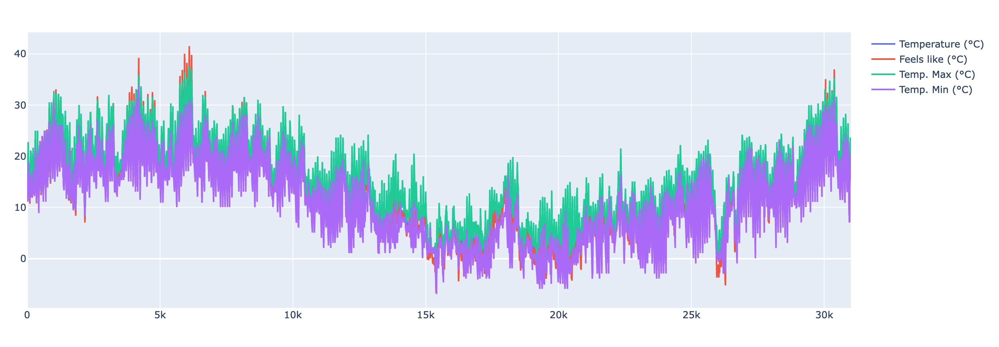

# OpenWeatherMap Utils

Utilities for OpenWeatherMap (fetching histories, showing and processing in Jupyter notebooks ...)

## Step 1: create an account on OpenWeatherMap.org

[Sign Up](https://home.openweathermap.org/users/sign_up)

Students had an extended access to the API [if they sign up as student](https://home.openweathermap.org/users/sign_up?student=true).

## Step 2: get your OpenWeatherMap.org API KEY

Open your profile and select [`My API Keys`](https://home.openweathermap.org/api_keys) for generating a new API KEY.

Copy the key in a shell

```bash
export OWM_API_KEY="MyAPIKeyHere"
```

## Step 3: fetch the weather and air pollution histories of your hometown

Get the latitude and the longitude of your hometown using [OpenStreetMap](https://www.openstreetmap.org).

Copy them in the current shell

```bash
export OWM_POI_NAME=HOMETOWN
export OWM_POI_LAT=45.5
export OWM_POI_LON=5.5
```

Fetch the weather history (one year, one file per week) into the [`./weather`](./weather) directory using the [Weather API](https://openweathermap.org/history):
```bash
./fetch_weather_histories.sh
gzip weather/*.json
```
> Max entry number per API request seems 8 days

Fetch the air pollution history (one year, one file per month) into the [`./air_pollution`](./air_pollution) directory using the [Air Pollution API](https://openweathermap.org/api/air-pollution):
```bash
./fetch_air_pollution_histories.sh
gzip air_pollution/*.json
```

> Max entry number per API request seems one month

Optional : Save your files
```bash
git add weather/*.json.gz
git add air_pollution/*.json.gz
git commit -m "save fetched files"
```

## Step 4: convert the `JSON` files into `CSV` files

Launch the script for convertion:
```bash
./json2csv
```

## Step 5: install and launch Jupyter

Install [Jupyter](https://jupyter.org/install) with your favorite package manager.

Launch Jupiter from your working directory :
```bash
jupyter notebook
```

## Step 6: open and execute the Jupyter notebooks for `weather` and `air_pollution`

Notebooks are `weather.ipynb` and `air_pollution.ipynb`



## Step 7: improve the Jupyter notebooks

See the [gallery of `plotly` plots and charts](https://plotly.com/python/)
